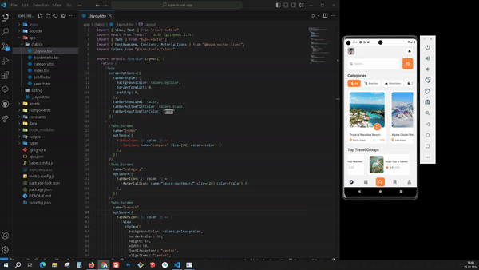

# **Travel App**

**Travel App**, kullanıcıların seyahat destinasyonlarını keşfetmelerine, detaylarını görüntülemelerine ve kolayca rezervasyon yapmalarına olanak tanıyan modern bir mobil uygulamadır. Uygulama, **React Native** kullanılarak geliştirilmiş ve gezginler için kullanıcı dostu bir deneyim sunmak amacıyla tasarlanmıştır.

## **Özellikler**

- **Destinasyon Detayları**:
  - Resimler, açıklamalar, konum bilgileri, süre, değerlendirme ve fiyat detayları.
- **Rezervasyon Yapma**:
  - Kullanıcıların destinasyonları hızlıca rezerve edebilmesi için kolay erişilebilir düğmeler.
- **Dinamik Animasyonlar**:
  - Kaydırma sırasında görüntülerde hareket ve ölçeklendirme.
- **Kullanıcı Dostu Gezinme**:
  - Basit ve etkili gezinme menüleri, başlık ikonları.

## **Kullanılan Teknolojiler**

- **React Native**: Uygulamanın temel geliştirme platformu.
- **Expo**: Hızlı geliştirme ve test süreçleri için.
- **Reanimated**: Performanslı animasyonlar ve kaydırma efektleri için.
- **JSON Veri Tabanı**: Destinasyon verilerini saklamak için.

## **Önizleme**

